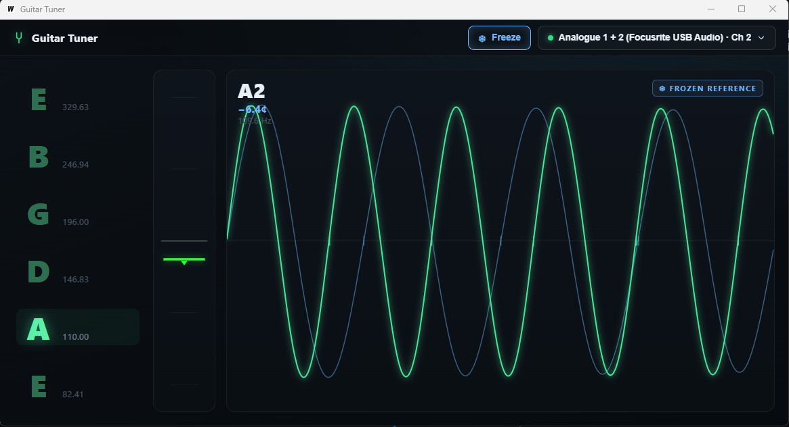

# Guitar Tuner

A sleek desktop guitar tuner built with **Go + [Wails](https://wails.io)**. Captures audio
via WASAPI, tracks pitch with the YIN algorithm, and shows tuning and a live oscilloscope.



## Build

Requires [Go](https://go.dev) and the [Wails CLI](https://wails.io/docs/gettingstarted/installation)
(`go install github.com/wailsapp/wails/v2/cmd/wails@latest`).

```bash
wails dev      # run with hot reload
wails build    # produce build/bin/tuner.exe
```

## Use

- **First launch** asks for a sound input device and channel (e.g. Input 1/2 on a Focusrite).
  The choice is saved and reused; change it any time from the button in the top-right menu.
  If the saved device is missing, the picker reopens automatically.
- **Play a string.** The matching letter (`E B G D A E`) lights up and the tuning pane's
  center bar glows green when you're within ±5 cents.
- **Waveform pane** shows the note band-pass filtered to a clean sine, scaled to four waves.
- **Freeze** (button or **Spacebar**) locks the current wave as a dim reference at a fixed
  scale — play against it to match pitch or octaves (a 2× note draws twice as dense).
